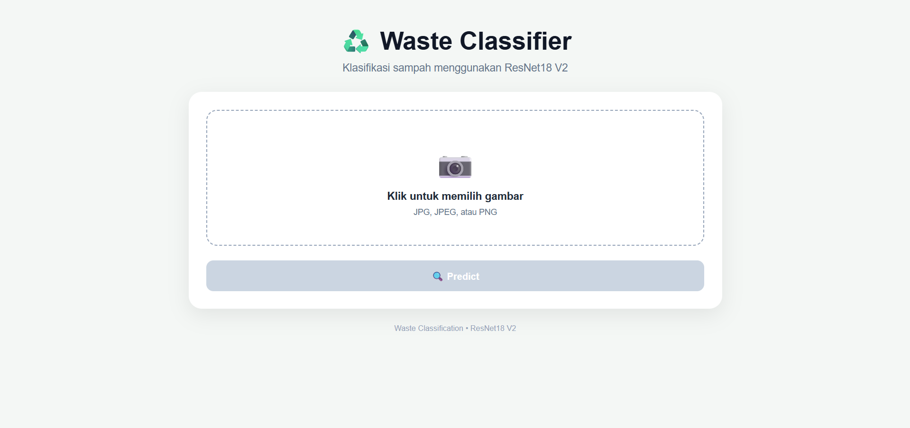
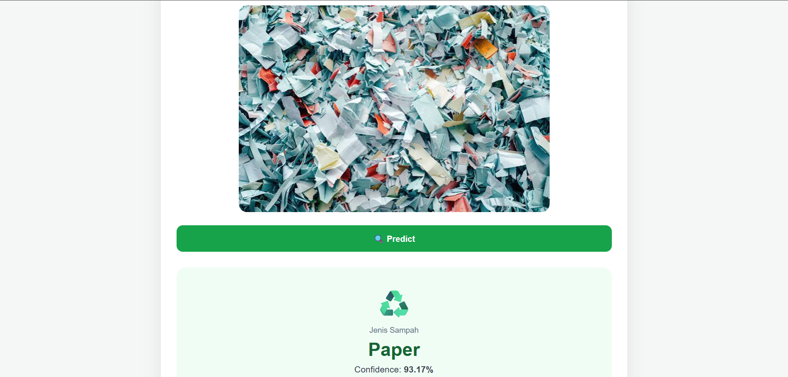
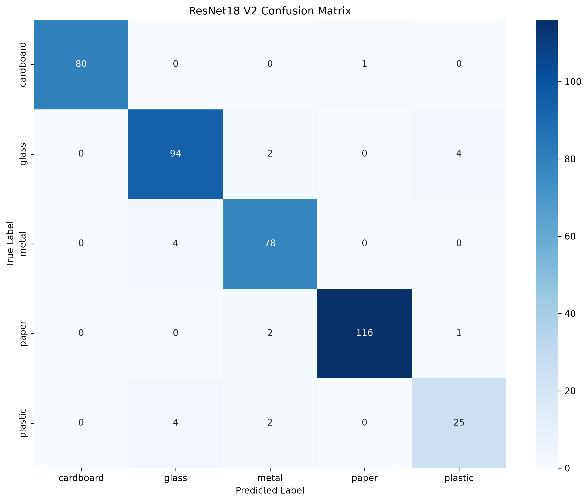

# ♻️ Waste Classification

An image classification application for identifying different types of waste using a deep learning model based on **ResNet18**.

The system classifies waste images into five categories:

- Cardboard
- Glass
- Metal
- Paper
- Plastic

This project covers the complete machine learning workflow, from dataset exploration and preprocessing to model training, evaluation, REST API development, and frontend integration.

---

## 📸 Application Preview

### Upload Interface

The application provides a simple web interface where users can upload an image of waste for classification.



### Prediction Result

After uploading an image, the system displays the predicted waste category, confidence score, and probability distribution for each class.



---

## ✨ Features

- Image-based waste classification
- Five waste categories
- ResNet18-based image classification
- Transfer learning
- Image preprocessing and normalization
- Validation accuracy evaluation
- Confusion matrix analysis
- Classification report
- REST API using FastAPI
- Interactive API documentation using Swagger UI
- Web-based frontend
- Prediction confidence score
- Probability distribution for all classes

---

## 🧠 Model

The project uses **ResNet18** with transfer learning for image classification.

A pretrained ResNet18 architecture is adapted to classify images into five waste categories.

### Classification Classes

| Class | Description |
|---|---|
| Cardboard | Cardboard waste |
| Glass | Glass waste |
| Metal | Metal waste |
| Paper | Paper waste |
| Plastic | Plastic waste |

The final classification layer is configured for five output classes.

---

## 📊 Model Performance

The final model achieved a **95.16% validation accuracy**.

| Metric | Result |
|---|---:|
| Validation Accuracy | **95.16%** |
| Validation Images | **413** |
| Number of Classes | **5** |
| Model Architecture | **ResNet18** |
| Device | CPU / CUDA |

### Classification Report

| Class | Precision | Recall | F1-Score | Support |
|---|---:|---:|---:|---:|
| Cardboard | 1.0000 | 0.9877 | 0.9938 | 81 |
| Glass | 0.9216 | 0.9400 | 0.9307 | 100 |
| Metal | 0.9286 | 0.9512 | 0.9398 | 82 |
| Paper | 0.9915 | 0.9748 | 0.9831 | 119 |
| Plastic | 0.8333 | 0.8065 | 0.8197 | 31 |
| **Accuracy** | | | **0.9516** | **413** |

### Average Metrics

| Metric | Score |
|---|---:|
| Macro Precision | 0.9350 |
| Macro Recall | 0.9320 |
| Macro F1-Score | 0.9334 |
| Weighted Precision | 0.9519 |
| Weighted Recall | 0.9516 |
| Weighted F1-Score | 0.9516 |

---

## 📉 Confusion Matrix

The final model was evaluated using a confusion matrix to analyse classification performance across all five waste categories.



The model performs particularly well on **cardboard** and **paper**.

Some misclassification occurs between **glass, metal, and plastic**, which can happen because these materials may have similar visual characteristics depending on their shape, colour, lighting, and background.

---

## 🏗️ System Architecture

The application consists of three main components:

```text
                    User
                     │
                     ▼
            ┌──────────────────┐
            │     Frontend     │
            │   HTML / CSS /   │
            │    JavaScript    │
            └────────┬─────────┘
                     │
                     │ HTTP POST
                     │ /predict
                     ▼
            ┌──────────────────┐
            │     FastAPI      │
            │     Backend      │
            └────────┬─────────┘
                     │
                     ▼
            ┌──────────────────┐
            │     ResNet18     │
            │      V2 Model    │
            └────────┬─────────┘
                     │
                     ▼
            ┌──────────────────┐
            │    Prediction    │
            │   + Confidence   │
            │ + Probabilities  │
            └──────────────────┘
